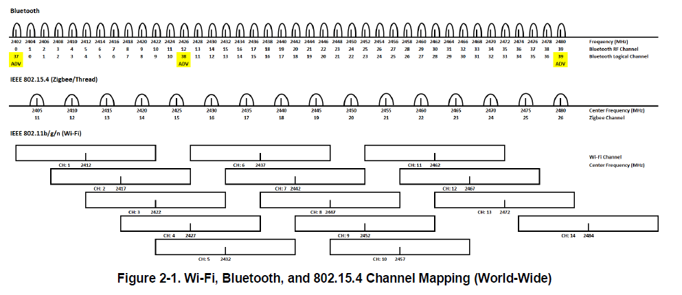
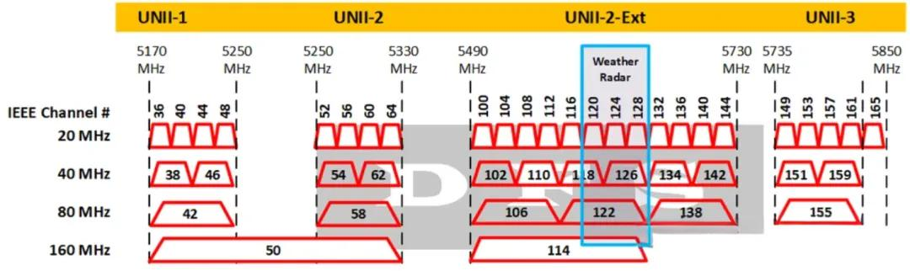
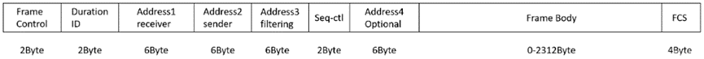
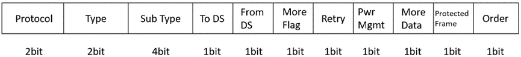
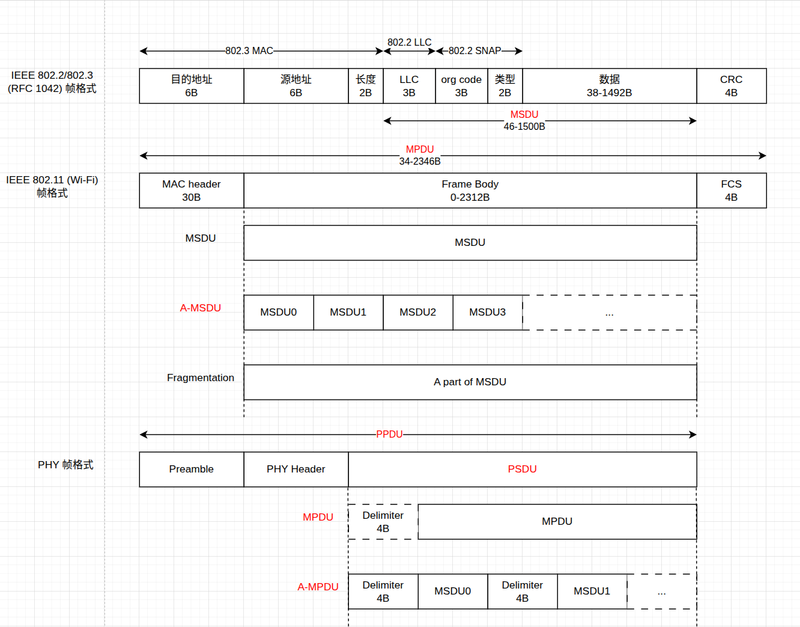
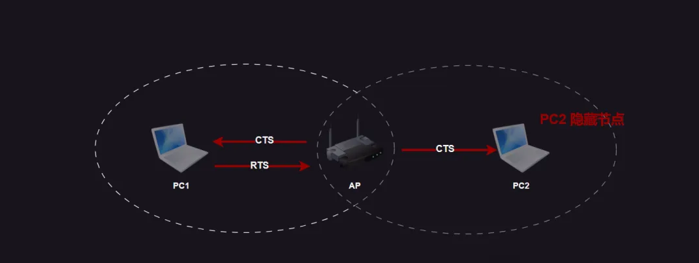
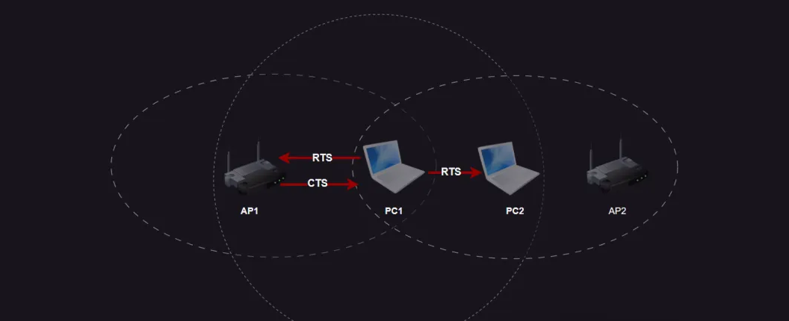
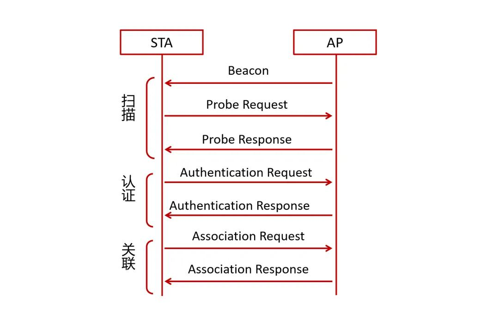

# IEEE 协会 与 802.11 标准

IEEE (Institute of Electrical and Electronics Engineers)电气与电子工程师协会,是一个国际性的专业学会组织，是全球最大的技术专业组织。

IEEE 802 是一个标准系列项目，包括以太网、局域网、城域网的多个技术标准。

IEEE 802.11 是 IEEE 802 标准系列中的一个工作组，专注于无线局域网 (WLAN) 技术。

802.11a/b/g/n... 是由 IEEE 802.11 工作组下的任务组开发的标准。

我们看到比较多的 WiFi 分类是按 802.11b/g/n 字母来区分，但是随着 WiFi 协议的不断发展，方便大家记忆和区分，WiFi 联盟对不同 WiFi 标准指定了新的名字，也就是 WiFi4、WiFi5、WiFi6、WiFi7 按数字代号表示；

| 标准| | 发布年份| 频段| 物理层技术| 编码方式| 空间流数| 信道带宽(MHz)| 理论速率|
| :-- | :-- | :-- | :-- | :-- | :-- | :-- | :-- | :-- |
| -       | 802.11  | 1997 | 2.4 GHz  | IR/FHSS/DSSS | -      | - | 20     | 2 Mbps  |
| -       | 802.11b | 1999 | 2.4 GHZ  | DSSS/CCK     | -      | - | 22     | 11 Mbps |
| -       | 802.11a | 1999 | 5 GHz    | OFDM         | -      | - | 20     | 54 Mbps |
| -       | 802.11g | 2003 | 2.4 GHz  | OFDM         | 64-QAM | - | 20     | 54 Mbps |
| Wi-Fi 4 | 802.11n | 2009 | 2.4/5 GHz| OFDM         | 64-QAM | 4 | 20/40  | 2.4GHz:450 Mbps 5GHz:600 Mbps|
| Wi-Fi 5 | 802.11ac Wave1 | 2013 | 5GHz | OFDM SU-MIMO    | 64-QAM  | 4+4 | 20/40   | 3.74 Gbps |
| Wi-Fi 5 | 802.11ac Wave2 | 2015 | 5GHz | OFDM 下行MU-MIMO | 256-QAM | 8 | 20/40/80/ 160/80+80 | 6.9 Gbps |
| Wi-Fi 6 | 802.11ax | 2019 | 2.4/5 GHz | OFDMA 下行MU-MIMO 上行MU-MIMO | 1024-QAM | 4+8 | 20/40/80/ 160/80+80 | 2.4GHz:1.15 Gbps 5GHz: 9.6 Gbps |
| Wi-Fi 7 | 802.11 be| 2024 | 2.4/5/6 GHz| OFDMA MU-MIMO CMU-MIMO| 4096-QAM | 16 | 20/40/80/ 160/320 | 46 Gbps |

# Wi-Fi 信道
## 2.4G 频段

IEEE 802.11b/g标准工作在2.4G频段，频率范围为 2.400-2.4835GHz，共 83.5M 带宽,划分为 14 个子信道，中国开放其中 13 个，相邻信道的中心频点间隔5MHz。

802.11b使用的信道频宽是 22MHz，目前使用的其它标准都是 20MHz 信道带宽。

所以传统认知上，有 3 个不重叠的信道(1、6、11)；但 802.11b 已经淡出 WLAN 网络，不考虑兼容性问题，通常情况下，可以认为 1、5、9 和 13 信道也是非重叠信道。

Wi-Fi 2.4G:
> 2412+5(k - 1) MHz, k = 1, ..., 13
>
> 2484 MHz, k = 14

此外： 蓝牙和 IEEE802154 也是 2.4G 下的常用无线协议，信道如下：

Bluetooth: 2.400-2.4835 GHz
> LE: 2402 + k * 2 MHz, k = 0, ..., 39
>
> BR/EDR: 2402+k MHz, k=0,...,78

IEEE802154
> 868.3 MHz, k = 0
>
> 906 + 2 (k – 1) MHz, k = 1, 2, ..., 10
>
> 2405 + 5 (k – 11) MHz, k = 11, 12, ..., 26

## 5G 频段

再来看看 5GHz 频段，包含 5150MHz-5825MHz 的无线电频段，一共拥有 201 个信道，但能用的确实不多，特别是在我国，仅有5个信道可用(149,153,157,161,165), 还有部分仅室内可用（不包括汽车内）（UNII-1 和 UNII-2）。

5 GHz 频段通常被划分为 4 个 UNII (Unlicensed National Information Infrastructure) 子频段。

20 MHz 信道：是最常用的信道带宽，适合在设备较多的环境中使用，以避免干扰

40 MHz 信道：通过聚合两个相邻的 20 MHz 信道，提供更高的吞吐量，但更容易受到干扰

80 MHz 和 160 MHz 信道：适用于对吞吐量要求极高的应用(如 4K 流媒体、高清视频会议)，但在实际使用中较少，因为它们占用了更多的频谱资源

## 6GHz 频段
在 WiFi6 和 WiFi7 中会使用到一些 6GHz 的信道，6GHz 频段范围从 5925MHz 扩展到 7125MHz，共计 1200MHz 频谱。它可以通过信道绑定成  3 个 320MHz 信道、7 个 160MHz 信道、14 个 80MHz 信道或者是 29 个40MHz 信道。如果不绑定直接使用，它提供了 59 个 20MHz 信道。

对比 2.4GHz 和 5GHz，6GHz 频段的频谱资源比前两者相加还要多，但是目前我国还没有开放 6GHz 信道的使用。

# Wi-Fi 帧
## 帧类型
802.11 无线 WiFi 网有三类帧：数据帧、管理帧、控制帧。

| 序号 | 管理帧类型 | 作用 |
| --- | --- | --- |
| 1 | Beacon信标 | 宣告网络存在，AP定期发送，终端通过其感知网络，范围即基本服务区域。 |
| 2 | Probe Request 检测请求帧 | 终端扫描区域内802.11网络。 |
| 3 | Probe Response 检测应答帧 | AP对符合连接需求的Probe Request应答，发送完Beacon后需应答直至下一Beacon发送。 |
| 4 | Authentication 认证帧 | AP用共享密钥和认证帧进行身份认证。 |
| 5 | Association Request 连接请求帧 | 终端通过身份认证后发送，试图加入网络；漫游时用Re-Association Request重新关联。 |
| 6 | Association Response 连接应答帧 | 终端尝试连接AP时，AP返回的应答帧。 |

| 序号 | 控制帧类型 | 作用 |
| --- | --- | --- |
| 1 | RTS（请求发送） | AP向客户端发送RTS后，覆盖范围内设备在指定时间内不发送数据。 |
| 2 | CTS（允许发送） | 客户端收到RTS后发送CTS，其覆盖范围内设备在指定时间内不发送数据。 |
| 3 | ACK（应答） | 每个数据帧接收成功后需发送ACK确认。 |
| 4 | PS-Poll（省电模式-轮询帧） | 终端从省电模式苏醒后发送，向AP请求缓存数据。 |

| 序号 | 数据帧类型 | 作用 |
| --- | --- | --- |
| 1 | 数据帧（无数据类型区分） | 普通数据传输。 |
| 2 | Qos数据帧 | 带服务质量信息，用于多媒体应用。 |

## 帧结构
802.11无线帧最大长度为2346个字节，基本结构如下：

* Frame Control: 帧控制字段，含有许多标识位，表示本帧的类型等信息。
* Duration ID: 本字段一共有16bit，根据第14bit和15bit的取值，本字段有以下三种类型的含义：
    1. 当第15bit被设置为0时，该字段表示该数据帧所传输要使用的时间，单位为微秒。（表明该帧和它的确认帧将会占用信道多长时间，Duration 值用于网络分配向量(NAV)计算）
    2. 当第15bit被设置为1，第14bit也为0时，该字段用于让没有收到Beacon新标帧（管理帧的一种）公告免竞争时间。
    3. 当第15bit被设置为1，第14bit为1时，该字段主要用于STA告知AP其关闭天线，将要处于休眠状态，并委托AP暂时存储发往该STA的数据帧。此时该字段为一种标识符，以便在STA接触休眠后从AP中获得为其暂存的帧。
* Address: 802.11与802.3以太网传输机制不同，802.11无线局域网数据帧一共可以有4个MAC地址，这些地址根据帧的不同而又不同的含义，但是基本上第一个地址表示接收端MAC地址，第二个地址表示发送端MAC地址，第三个地址表示过滤地址。
* Seq-ctl: 顺序控制位，该字段用于数据帧分片时重组数据帧片段以及丢弃重复帧。
* Frame Body: 帧所包含的数据包。
* FCS 帧校验和:主要用于检查帧的完整性。

### Frame Control
Frame Control字段格式如下：

* Protocol 表示802.11协议版本，目前802.11数据帧 只有一个版本，该字段为0。
* Type 表示802.11帧的类型。
    * 00：表示本帧为管理帧；
    * 01：表示本帧为控制帧；
    * 10：表示本帧为数据帧。
    * 一般来说控制帧、管理帧都是不需要加密传输的，而数据帧则需要加密后再进行传输，另外一些特殊用途的NULL数据帧也是不加密的，比如power save status的帧。
* SubType 具体到某一类型的802.11帧，更加详细的表明其类型。
* To DS 表示该帧是否向 DS 发送的帧。
    * DS（Distribution System）：分布系统，是 802.11 里一个逻辑概念，是把多个 AP 连接起来、并把无线网络接入更大网络（通常是以太网）的“中间体系”。
    * 可以简单理解为是 AP + 网络
* From DS 表示该帧是否从 DS 发送的帧。
* More Fragment 表示该帧是否有更多的分片。
* Retry 表示该帧是否需要重传。
* Power Management 用于休眠控制
    * 如果此 bit 为 1，则表示 STA 在发送完本帧后，将关闭天线处于休眠状态。（AP 不允许关闭天线休眠，因此 AP 发送的数据帧该字段恒为 0）
* More Data 表示在该帧传送完成后，将会有更多的数据，此bit只用于管理数据帧，在控制帧中此bit恒为0。
* Protected 如果该bit为1，表示该帧受到链路层安全协议的保护。
* Order 如果字段为1，表示帧和帧片段将会严格按照次序传送，但是这样会对发送与接收端带来额外的开销。

### Address
802.11 帧中 Address 字段含义根据帧的不同而不同，具体如下表所示：

| To DS | From DS | 含义                   | Address1 | Address2 | Address3 | Address4 |
| ----- | ------- | -------------------- | --- | --- | --- | --- |
| 0     | 0       | IBSS / 管理帧           | DA/RA | SA/TA | BSSID | 未用 |
| 1     | 0       | STA → AP（进 DS）       | BSSID/RA | SA/TA | DA | 未用 |
| 0     | 1       | AP → STA（出 DS）       | DA/RA | BSSID/TA | SA | 未用 |
| 1     | 1       | AP ↔ AP（WDS，经 DS 转发） | BSSID/RA | BSSID/TA | DA | SA |

这里介绍一些基本概念：
BSS： 最小的无线网络单元，是任意两个无线设备的连接
IBSS： 没有 AP 的网络
BSSID： BSS 的 ID，一般为 AP 的 MAC, IBSS 中为一个随机的 MAC
DA（Destination Adress）： 目的（最终接收方） Adress
SA（Source Address）： 源（最终发送方） Adress
TA（Transmitter Adress）： 实际的发送者
RA（Receiver Address）： 这一次发送的实际接收者
WDS（Wireless Distribution System）：无线分布系统，用 Wi-Fi 自己来承载“AP ↔ AP”之间的分发链路（DS）。

### Frame Body

如图：

* MSDU（MAC Service Data Unit）
    * 一个 802.2 的帧
* A-MSDU（Aggregated MAC Service Data Unit）
    * 多个 MSDU 的聚合
* MPDU（MAC Protocol Data Unit）
    * 一个 Wi-Fi 的帧
* Frame Body
    * Wi-Fi 帧中的数据段，可以是下面中的一个
        * MSDU
        * A-MSDU
        * Fragmentation： MSDU 的一部分
* A-MPDU（Aggregated MAC Protocol Data Unit）
    * 多个 MPDU 的聚合
* Delimiter
    * A-MPDU 里的分隔符，共 4B，由 Reserved， Length， CRC 组成
* PPDU（PHY Protocol Data Unit）
    * Wi-Fi 在空气中实际传输的内容
* PSDU（PHY Service Data Unit）
    * PPDU 中的数据段，可以是下面中的一个
        * MPDU
            * 此时可以没有 Delimiter，但大多数厂家会带上
        * A-MPDU

## 帧冲突
### 有线网 CSMA/CD
在有线网络中，设备间通过网线相互连接，采用 CSMA/CD (Carrier Sense Multiple Access with Collision Detection,载波侦听多路访问与冲突检测)：

* 载波侦听：设备在发送数据之前会先监听网络，以检测是否有其他设备在传输数据。如果检测到网络空闲，则开始发送数据。
* 冲突检测： 在数据发送过程中，设备持续监听网络。如果检测到冲突 (即两个或多个设备同时发送数据导致信号混合) ，发送数据的设备会停止传输，并发送一个“冲突信号”以通知网络上的其他设备。
* 重传数据： 发生冲突后，设备会等待一段随机的时间后再次尝试发送数据。这个随机等待时间称为“退避算法”，可以有效减少后续冲突的可能性。

### 无线网 CSMA/CA
与有线网不同的是，无线网它是通过电磁波进行数据交互。无线是半双工工作模式，无线客户端没有同时进行接收和发送的能力，无法检测到冲突。

所以有线网络中的冲突检测方式，在无线中并不适用，并且无线中还存在相邻站点不一定能侦听到对方的情况（隐藏节点问题）：

#### 隐藏节点

隐藏节点指在接收者的通信范围内而在发送者通信范围外的节点。例如 AP 位于两个 PC 中间，并且距离两个 PC 都比较远，这个时候 PC1 检测不到 PC2 的信号，两个 PC 之间都不知道对方是否有在给 AP 发送数据。

所以无线网引入了 CSMA/CA ( Carrier Sense Multiple Access with Collision Avoidance，载波侦听多路访问/冲突避免)

* 载波侦听：设备在发送数据之前也会监听无线信道，检查是否有其他设备在使用。只有信道空闲，设备才会继续执行发送操作。
* 冲突避免：为了尽量避免冲突，在发送数据之前，设备可能会先发送一个“准备发送”信号 (如RTS，即请求发送) ，并等待接收设备返回“允许发送”信号 (如CTS，即清除发送) 。
* 数据发送：收到 CTS 信号后，设备才会发送数据。
* ACK确认：数据发送成功后，接收设备会发送一个确认信号 (ACK) 。如果发送设备在规定时间内没有收到 ACK，它会认为数据丢失并重新发送。

隐藏节点解决方案如下：
* PC1 要发送数据，所以它发送了 RTS 帧， 这时路由器可以收到该 RTS 帧，但是 PC2 与 PC1 距离较远，PC2 收不到 PC1 的 RTS 帧。
* 路由器 AP 收到PC1 的 RTS 帧后，会同时向 PC1 和 PC2 发送 CTS 帧。
* PC1 收到路由器发的 CTS 帧后，PC1 开始发送数据。
* PC2 收到路由器发的 CTS 帧后，PC2 保持安静，不能发送数据。

#### 暴露节点
但该方法同时引入了新的问题：暴露节点问题

暴露节点指在发送者的通信范围之内而在接收者通信范围之外的节点。

暴露节点解决方案如下：
* PC1 要发送数据，于是发送 RTS 帧，AP1 和 PC2 都可以接收到该 RTS帧
* AP1 收到 RTS 帧后，会发送 CTS 帧
* PC1 收到 CTS 帧后可以开始传输数据
* PC2 如果也收到了 AP1 的 CTS 帧，PC2 不能与 AP2 发送数据，只能保持安静
* PC2 如果只收到 PC1 的 RTS 帧，但是没有收到 AP1 发送的 CTS帧，这个时候 PC2 可以发送数据给 AP2,并且也不会影响到 AP1 数据的接收

#### 随机退避算法 (Random Backoff Algorithm)
当信道忙碌时，设备不会立即重新尝试发送数据，而是会等待一个随机的时间段后再尝试。这种随机等待时间由 退避算法 (Backoff Algorithm) 决定，以减少多个设备同时再次尝试发送数据的可能性，从而避免冲突。

#### 帧间间隔 (Interframe Space, IFS)
IFS  (Interframe Space, 帧间间隔) 用于控制设备在发送数据帧之间的等待时间，以确保无线信道的公平性和有效性。根据不同的情况，IEEE 802.11 标准定义了几种不同类型的 IFS：

* 短帧间间隔 (Short Interframe Space, SIFS)
    * 应用场景：用于高优先级的操作，如 ACK 确认帧、CTS 帧、以及从站的响应帧。
    * 是所有 IFS 中最短的，确保重要数据能够迅速传输而不受其他帧的干扰。由于它的间隔短，接收方可以快速发出确认，减少等待时间，提高数据传输效率。
* 点协调功能帧间间隔 (Point Coordination Function Interframe Space, PIFS)
    * 应用场景：用于集中控制模式下，接入点 (AP) 在无竞争的情况下使用，如在 PCF (点协调功能) 模式下的优先级操作。
    * 等待时间比 DIFS 短，但比 SIFS 长。它主要用于在竞争前启动通信，以便接入点在竞争阶段之前获得信道控制权。
* 分布式协调功能帧间间隔 (Distributed Coordination Function Interframe Space, DIFS)
    * 应用场景：用于普通数据帧的传输，通常在竞争环境中使用。
    * 是正常数据帧在竞争信道时使用的间隔。它的等待时间比 PIFS 长，确保优先级较低的设备在优先级较高的操作完成后再尝试发送数据。
* 扩展帧间间隔 (Extended Interframe Space, EIFS)
    * 应用场景：当一个设备接收到一个有错误的数据帧时，它会等待 EIFS 时间后再试图发送数据。
    * 是所有 IFS 中最长的，旨在避免网络中更多的冲突或干扰发生。当设备认为信道状况不佳时，会使用更长的等待时间以减少进一步的冲突。

# 设备发现与连接

当 STA 设备连接到路由器 AP 的时候，有三个过程：扫描、认证、关联。

## 扫描 (Scanning)
WiFi 标准中定义了两种主要的扫描方式：主动扫描 (Active Scanning) 和被动扫描 (Passive Scanning)

### 主动扫描 (Active Scanning)
设备会设备依次切换到不同的信道，主动向周围的无线信道发送探测请求 (Probe Request) ，并等待 AP 发送探测响应 (Probe Response)

其中 Probe Request 包括：
* SSID (可以是具体的SSID，也可以是广播请求)
* 支持的速率
* 扩展功能信息 (如支持的安全协议)

Probe Request 可以是针对所有网络的广播，也可以是针对特定 SSID 的单播。、
* 当 Probe Request 中有携带需要探测的 SSID 信息，只有 SSID 能够匹配上的 AP 才会返回探测响应包。
    * 场景一般是设备已经配置过网络，设备端有保存需要连接的 AP ，设备上电就直接扫描该 AP 是否存在。
* 当 Probe Request 是针对所有网络的广播时，探测包中 SSID 信息是为 NULL，接收到该探测包的 AP 都会返回探测响应包。
    * 场景是我们要手动去连接 WiFi 时，先会去扫描所有的信道的 WiFi 热点，然后生成一个 WiFi 热点列表。

Probe Response 主要包括：
* SSID (网络名称)
* BSSID (AP的MAC地址)
* 信道号
* 支持的速率
* 安全协议信息 (如WPA/WPA2)
* 网络容量和设备数量
* 其他可能的扩展功能 (如QoS、WMM等)

优缺点：

优点：能够快速发现隐藏的 WiFi 网络 (隐藏SSID的网络) ，因为设备可以通过探测请求主动询问某个特定SSID的存在。

缺点：主动发送请求帧会增加设备的能耗，且在某些环境中可能暴露设备的存在和意图，减少隐私性。

### 被动扫描 (Passive Scanning)
设备不会主动发送探测请求，而是依次切换到不同的信道，通过监听特定信道上的信标帧 (Beacon Frame)，从中获取 AP 的信息。

Beacon Frame 是 AP 会定期 (通常是100ms)在指定信道上广播的信标帧。信标帧包含了AP的关键信息，包括：
* SSID
* BSSID (AP的MAC地址)
* 支持的传输速率
* 信道号
* 安全信息 (如WPA/WPA2)
* 网络时间戳 (用于同步设备的时钟)
* 其他可能的功能 (如WMM、HT Capabilities、VHT Capabilities等)

优缺点：

优点：更节能，因为设备只需被动监听信标帧，而不需要主动发送请求。它也不会暴露设备的身份和意图，增强了隐私性。

缺点：相比主动扫描，发现 AP 的速度较慢，因为设备必须等待 AP 广播信标帧。尤其在密集的网络环境中，等待多个 AP 广播信标帧可能会耗费更多时间。

## 认证 (Authentication)
认证是设备和 AP 之间相互确认身份的过程。主要分：

* 开放系统认证 (Open System Authentication)：这是最简单的方式，不需要设备和AP之间进行任何密钥交换，所有请求都会通过。
* 共享密钥认证 (Shared Key Authentication)：设备和 AP 会通过 WEP (Wired Equivalent Privacy) 密钥进行加密认证。这种方式现已很少使用，因为 WEP 的安全性较差，已被更强的 WPA/WPA2/WPA 3等认证方式取代。

## 关联
设备与 AP 之间会进行详细的参数交换，确保双方能够兼容并高效地进行后续通信。

 现代 WiFi 网络一般使用 WPA/WPA2/WPA3 等协议进行身份验证，结合了 PSK (Pre-Shared Key) 或企业级的 RADIUS 认证服务器来提升安全性。
https://www.cnblogs.com/liwen01/p/18428321
https://www.cnblogs.com/pass-ion/p/17458079.html