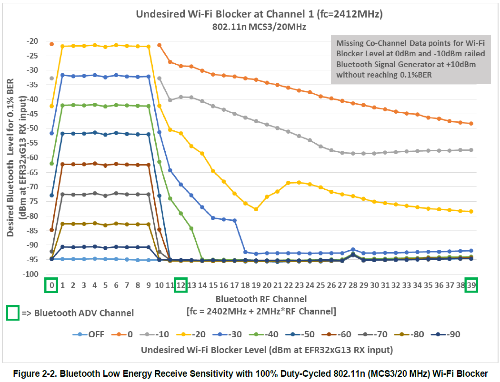
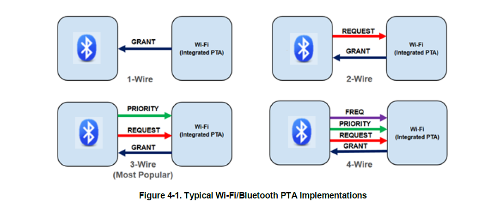

# BT & Wi-Fi Coex:

* tx power
    * Wi-Fi: < 20dBm
    * BT : < 10 dBm
    * 

* 频分复用：
    * 
    * BT: set AFH
    * Wi-Fi : 20M
        * any Wi-Fi station can set the Forty MHz Intolerant bit in the HT Capabilities Information. This bit informs the Wi-Fi access point that other 2.4 GHz ISM devices are present, forcing the entire Wi-Fi network to 20 MHz mode.
    * Wi-Fi: 选择两端信道，减少附近频道干扰
* 时分复用：
    * Wi-Fi: NULL 包防降速
    * Wi-Fi: Implements Aggregation 包聚合？
* 物理方面：
    * 双天线距离和方向
    * Wi-Fi Supports Directional PRIORITY 同时收
* 动态优先级：
* 外部共存：
    * 
