

# 五层模型

TCP / IP 协议族中，有很多种协议。 下图例举了每层的代表性协议。

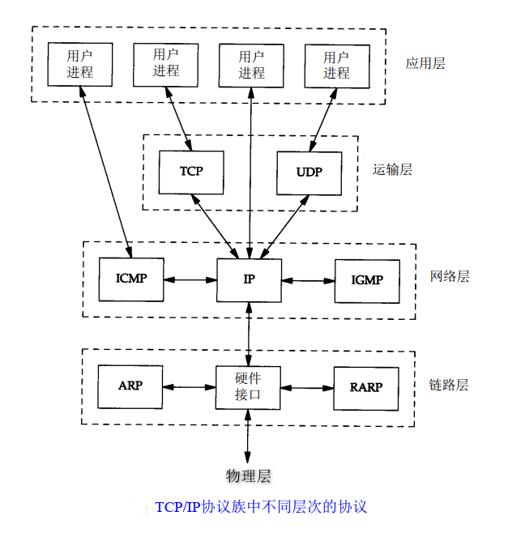

1. 物理层 (Physical)
    * 负责把二进制数据转换成电信号/光信号/无线电波等在介质中传输。
2. 数据链路层（Data Link）
    * 负责把比特封装成“帧”，并用 MAC 地址在同一局域网内传输。
    * ARP/RARP 运行在以太网之上，用于将 IP 地址和 MAC 地址的转换
    * ARP/RARP 和网络层有关，有些说法是介于两层之间，它本身的数据格式、广播机制、封装方式都属于二层行为，一般归类在链路层辅助协议。
3. 网络层（Network）
    * 负责用 IP 地址跨网段选择路径，把报文送到目标网络。
4. 传输层（Transport）
    * 负责端到端通信，确保数据可靠（TCP）或快速（UDP）送到目标进程。
5. 应用层（Application）
    * 提供用户真正使用的网络服务，如 HTTP、DNS、FTP。

用户数据进入协议栈，在每层间都会经过封装，可能还会伴随着分片和重组操作，下图例举了用户数据通过 TCP 传送到以太网的封装过程（忽略了分片和重组）：

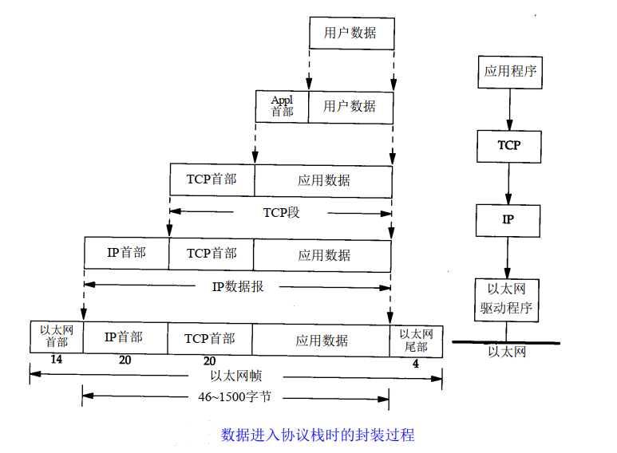

# 物理层（Physical）

物理层负责把二进制数据转换成电信号/光信号/无线电波等在介质中传输。

# 数据链路层（Data Link）

数据链路层负责把比特封装成“帧”，并用 MAC 地址在同一局域网内传输。

## 以太网和 802

以太网（Ethernet）是当今 TCP/IP 采用的主要的局域网技术。它采用一种称作 CSMA/CD 的媒体接入方法，其意思是带冲突检测的载波侦听多路接入（ Carrier Sense, Multiple Access with Collision Detection）。它的速率为10 Mb/s，地址为48 bit。

802 委员会公布了一个稍有不同的标准集，其中 802.3 针对整个 CSMA/CD 网络，802.4 针对令牌总线网络，802.5 针对令牌环网络。这三者的共者的同特性由 802.2 标准来定义，那就是 802 网络共有的逻辑链路控制（LLC）。

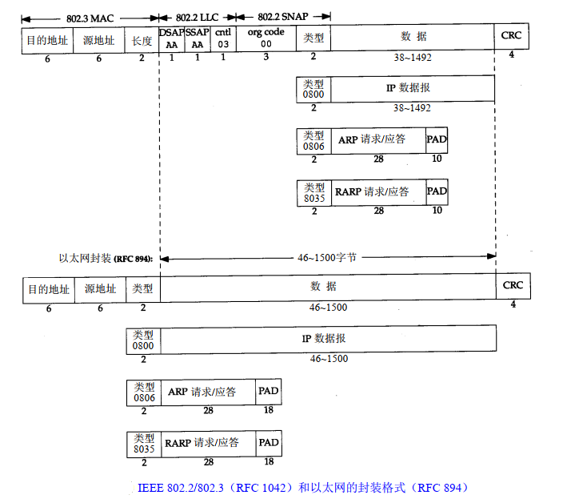

## SLIP
串行线路互联网协议（Serial Line Internet Protocol）

尾部加上 `END`，但为了防止报文前面已经在误收，通常在报文首部也加上 `END`，用来结束上个报文。

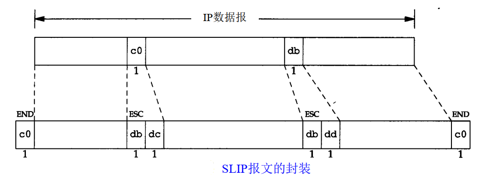

### 转义
* END: 0xc0
* ESC: 0xdb
* 0xc0 -> 0xdb 0xdc
* 0xdb -> 0xdb 0xdd

### 缺陷
* 每一端必须知道对方的 IP 地址。没有办法把本端的 IP 地址通知给另一端。
* 数据帧中没有类型字段（类似于以太网中的类型字段）。如果一条串行线路用于 SLIP，那么它不能同时使用其他协议。
* 没有在数据帧中加上检验和

### 应用
适用于家庭中每台计算机几乎都有的 RS-232 串行端口和高速调制解调器接入 Internet

## CSLIP

压缩串行线路互联网协议（Compressed Serial Line Internet Protocol）

将 20 个字节的 IP 首部和 20 个字节的 TCP 首部压缩到 3 或 5 个字节。并能在 CSLIP 的每一端维持多达 16 个 TCP 连接。

## PPP
点对点协议（Point-to-Point Protocol)

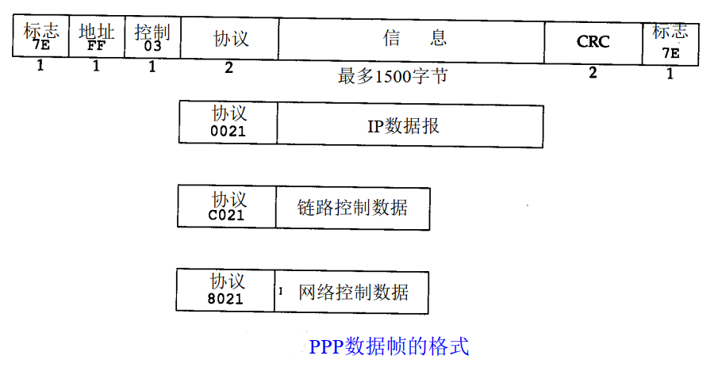

### 转义
标志字符: 0x7e

同步链路中，转义过程是通过一种称作比特填充 (bit stuffing) 的硬件技术来完成的

异步链路中

* 0x7e -> 0x7d 0x5e
* 0x7d -> 0x7d 0x5d
* 小于 0x20 的字符通常被解释成特殊含义，也需要转义。例如 0x01 -> 0x7d 0x21 （这时，第 6个比特取补码后变为1，而前面两种情况均把它变为 0）

### 优缺点
* 支持在单根串行线路上运行多种协议，不只是 IP 协议；
* 每一帧都有循环冗余检验；
* 通信双方可以进行 IP 地址的动态协商(使用 IP 网络控制协议)；
* 与 CSLIP 类似，对 TCP 和 IP 报文首部进行压缩；
* 链路控制协议可以对多个数据链路选项进行设置。
* .
* 每一帧的首部增加 3个字节，当建立链路时要发送几帧协商数据，以及更为复杂的实现。

## 环回接口

环回接口（ Loopback Interface）

允许运行在同一台主机上的客户程序和服务器程序通过 TCP/IP 进行通信。

A类网络号 127 就是为环回接口预留的。大多数系统把 IP 地址 127.0.0.1 分配给这个接口，并命名为 localhost。

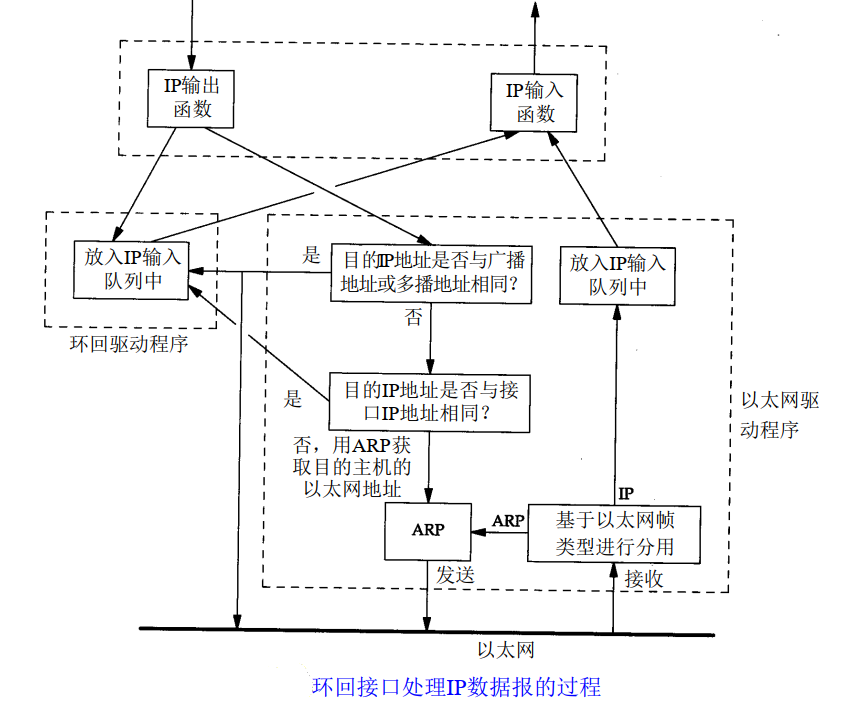

## ARP

# 网络层（Network）

网络层负责用 IP 地址跨网段选择路径，把报文送到目标网络。

## IP
互联网协议（Internet Protocol）

提供不可靠、无连接的数据报传送服务

* 不可靠（unreliable）：它不能保证 I P数据报能成功地到达目的地。
* 无连接（connectionless）：不维护任何关于后续数据报的状态信息，每个数据报的处理是相互独立的。即数据报文可能会乱序。

### IPv4
#### IPv4 地址
IPv4 地址长度为 4 字节，根据地址范围，分为 5 类：

| 类别      | 范围                          | 用途   |
| :------- | :--------------------------- | :---- |
| A 类 | 0.0.0.0 – 127.255.255.255   | 大型网络 |
| B 类 | 128.0.0.0 – 191.255.255.255 | 中型网络 |
| C 类 | 192.0.0.0 – 223.255.255.255 | 小型网络 |
| D 类 | 224.0.0.0 – 239.255.255.255 | 多播   |
| E 类 | 240.0.0.0 – 255.255.255.255 | 实验   |

其中每类的地址各部分含义如下：

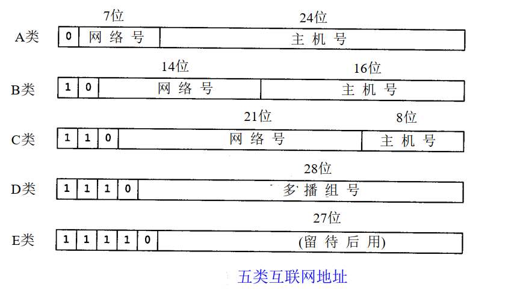

在实际应用中，地址也可以按用途分类：

采用 CIDR（Classless Inter-Domain Routing，无类域间路由）分类方法，将地址分为网络号和主机号两部分。其格式为：

> IP地址/前缀长度

前缀长度为网络号占的 bit 数。

例如： `10.0.0.0/8` 表示前 8 bit 位网络号，其余的为主机号。

* 单播地址（Unicast）
    * 公有地址
    * 私有地址
        * 10.0.0.0/8
        * 172.16.0.0/12
        * 192.168.0.0/16
    * 链路本地地址（APIPA）：169.254.0.0/16
    * 回环地址（Loopback）：127.0.0.1/8
    * 广播控制地址
        * 网络地址（全0）
        * 广播地址（全1）
* 广播地址（Broadcast）
    * 直接广播：如 192.168.1.255
    * 受限广播：255.255.255.255（只在本地网络中有效）
* 多播地址（Multicast）
    * 范围：224.0.0.0 – 239.255.255.255

#### 报文格式
IPv4 报文格式如下：

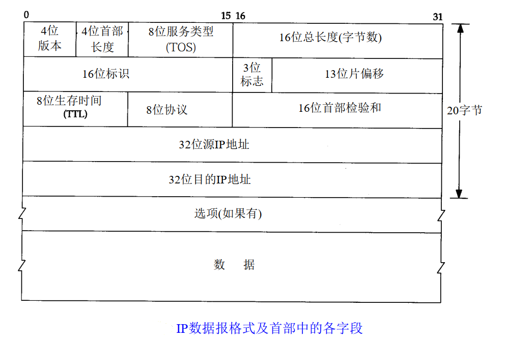

其中

* 版本
    * 4： IPv4
    * 6： IPv6
* 首部长度
    * 指的是首部长度，包括任何选项。 单位为字（32bit）。范围为 5-15（20-60 字节）。
* 服务类型（TOS）
    * 3 bit 的优先权子字段（现在已被忽略）。
    * 4 bit 的 TOS 子字段。
        * 分别代表最小时延、最大吞吐量、最高可靠性和最小费用。
        * 只能选置其中 1 bit。 如果所有4 bit 均为 0，那么就意味着是一般服务。
    * 1 bit 未用位但必须置 0。
* 总长度
    * 指整个 IP 数据报（包括首部）的长度，单位为字节。
* 标识
    * 该字段唯一地标识主机发送的每一份数据报。通常每发送一份报文它的值就会加 1。
* 标志/片偏移
    * 分片相关
* TTL（time-to-live）生存时间
    * 设置了数据报可以经过的最多路由器数。它指定了数据报的生存时间。
    * TTL 的初始值由源主机设置（通常为 32 或 64），一旦经过一个处理它的路由器，它的值就减去 1。当该字段的值为 0 时，数据报就被丢弃，并发送 ICMP 报文通知源主机。
* 协议
    * 上层协议编号

| 协议号 | 协议 | 说明 |
| :-- | :--   | :-- |
| 1   | ICMP  | Ping / 网络控制信息 |
| 2   | IGMP  | 组播管理 |
| 6   | TCP   | 面向连接的传输层协议 |
| 17  | UDP   | 无连接的传输层协议 |
| 47  | GRE   | 隧道封装 |
| 50  | ESP   | IPSec 加密载荷 |
| 51  | AH    | IPSec 认证 |
| 89  | OSPF  | 路由协议 |
| 132 | SCTP  | 电信常用传输层协议 |

* 首部检验和
    * 首先把检验和字段置为 0。 然后，对首部中每个 16 bit 进行二进制反码求和（整个首部看成是由一串 16 bit的字组成） ，结果存在检验和字段中。
    * 收到一份 IP 数据报后，同样对首部中每个 16 bit 进行二进制反码的求和。由于接收方在计算过程中包含了发送方存在首部中的检验和，因此，如果首部在传输过程中没有发生任何差错，那么接收方计算的结果应该为全 1。
    * ICMP、 IGMP、 UDP 和 TCP 都采用相同的检验和算法。
* 源 IP 地址/目的 IP 地址
    * 该报文的源地址和目的地址。
* 选项
    * 是数据报中的一个可变长的可选信息。目前，这些任选项定义如下：
        * 安全和处理限制（用于军事领域，详细内容参见 RFC 1108[Kent 1991]）
        * 记录路径（让每个路由器都记下它的 IP 地址）
        * 时间戳（让每个路由器都记下它的 IP 地址和时间）
        * 宽松的源站选路（为数据报指定一系列必须经过的 IP 地址）
        * 严格的源站选路（与宽松的源站选路类似，但是要求只能经过指定的这些地址，不能经过其他的地址）
    * 这些选项很少被使用，并非所有的主机和路由器都支持这些选项。
    * 选项字段一直都是以 32 bit 作为界限，在必要的时候插入值为 0的填充字节。这样就保证 IP 首部始终是 32 bit 的整数倍。
### IPv6
#### 报文格式
IPv6 报文格式如下：

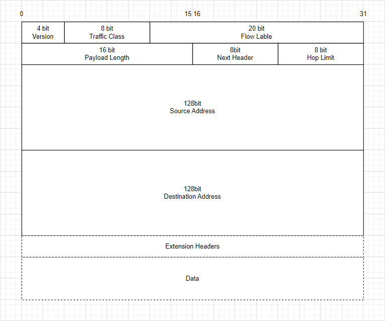

其中

* Version
    * 4： IPv4
    * 6： IPv6
* Traffic class
    * 流量类别。该字段及其功能类似于 IPv4 的 `服务类型（TOS）`字段。该字段以区分业务编码点（DSCP）标记一个 IPv6 数据包，以此指明数据包应当如何处理。
* Flow Label
    * 流标签。该字段用来标记 IP 数据包的一个流，当前的标准中没有定义如何管理和处理流标签的细节。
* Payload length
    * 表示有效载荷的长度，有效载荷是指紧跟 IPv6 基本报头的数据包，包含 IPv6 扩展报头 `Extension Headers`。
* Next header
    * 指明了跟随在IPv6基本报头后的扩展报头 `Extension Headers` 的信息类型。

| 类型 | 含义 | 相关标准 |
| :-- | :--   | :-- |
| 0   | IPv6 Hop-by-Hop Option      | [RFC 8200](https://tools.ietf.org/html/rfc8200) |
| 1   | ICMP                        | [RFC 792](https://tools.ietf.org/html/rfc792) |
| 2   | IGMP                        | [RFC 1112](https://tools.ietf.org/html/rfc1112) |
| 3   | GGP (Gateway-to-Gateway)    | [RFC 823](https://tools.ietf.org/html/rfc823) |
| 4   | IPv4 encapsulation          | [RFC 2003](https://tools.ietf.org/html/rfc2003) |
| 5   | Stream                      | [RFC 1190](https://tools.ietf.org/html/rfc1190)  [RFC 1819](https://tools.ietf.org/html/rfc1819) |
| 6   | TCP                         | [RFC 9293](https://tools.ietf.org/html/rfc9293) |
| ... | ...                         | ... |
| 17  | UDP                         | [RFC 768](https://tools.ietf.org/html/rfc768) |
| ... | ...                         | ... |
| 254 | Use for experimentation and testing | [RFC 3692](https://tools.ietf.org/html/rfc3692) |
| 255 | Reserved                    | - |

* Hop limit
    * 跳数限制，该字段定义了 IPv6 数据包所能经过的最大跳数，这个字段和 IPv4 中的 `TTL` 字段非常相似。
* Source Address/Destination Address
    * 该报文的源地址和目的地址。
* Extension Headers
    * 可变扩展报头。 IPv6 取消了 IPv4 报头中的`选项`字段，并引入了多种扩展报文头，在提高处理效率的同时还增强了 IPv6 的灵活性，为 IP 协议提供了良好的扩展能力。
    * 不是所有的扩展报头都需要被转发路由设备查看和处理的。路由设备转发时根据基本报头中 `Next Header` 值来决定是否要处理扩展头。
    * `Extension Headers` 可以由多个 Extension Header 组成，每个格式如下
        * 
        * `Next Header`：指向下一个扩展头或上层协议
        * `Hdr Ext Len`：表示该扩展头的长度，单位为 8 字节，但不包括前 8 字节，即 Extension Header 的总长度为 `8 * (Hdr Ext Len + 1)B`
        * `Date/填充`：根据类型不同差异很大
    * 下面给出了一个完整的报文格式
        * 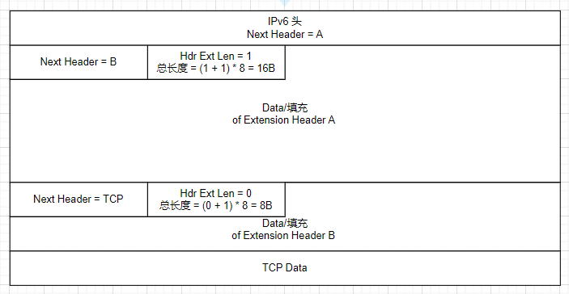

### 子网

把主机号再分成一个子网号和一个主机号。

同时用子网掩码来区分子网号和一个主机号，子网掩码是一个 32 bit 的值，其中值为 1 的比特留给网络号和子网号，为 0 的比特留给主机号。

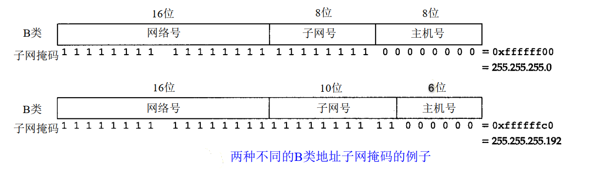

上图第一种分配方式有 254 个子网，每个子网可以有 254 台主机。第二种分配方式有 1024 个子网，每个子网可以有 64 台主机。

子网可以缩小 Internet 路由表的规模。

因为某网络号被划分为若干子网的事实对于所有子网以外的 Internet 路由器都是透明的。对外部路由器隐藏了内部网络组织（一个校园或公司内部）的细节。 但子网对于子网内部的路由器是不透明的。

> **透明（transparent）** 在通信和网络领域通常指：
> 某个机制的存在不影响外部观察者，外部观察者感觉不到它的存在。

例如有下面两组网络，外部路由想到达主机 `140.252.xxx.xxx`。

1. 网络号 `140.252`，子网掩码 `255.255.255.0`
    * 1 个网络号，256 个子网，每个子网 256 个主机，共 65535 台主机。
    * 因为子网对外部路由器透明，所有到达 `140.252.xxx.xxx` 的报文都只需要发给网络号 `140.252` 即可，即只需要一个路由表目。
2. 网络号 `140.252.0` - `140.252.255`，无子网
    * 256 个网络号，无子网，每个网络号 256 个主机，共 65535 台主机。
    * 外部路由器需要从路由表 `140.252.0` - `140.252.255` 中找到 `140.252.xxx`，然后发给对应的端口，所以需要 256 个路由表目。

### 路由转发
IP 可以接收本地生成的数据报（TCP、 UDP、 ICMP 和 IGMP）或者接收一个网络接口的数据报，并进行发送。

IP 层在内存中有一个路由表。当收到一份数据报并进行发送时，它都要对该表搜索一次。IP 首先检查目的 IP 地址是否为本机的 IP 地址之一或者 IP 广播地址。

如果是，数据报就被送到由 IP 首部协议字段所指定的协议模块进行处理。

如果数据报的目的不是这些地址，那么果 IP 层被设置为路由器的功能，那么就对数据报进行转发（TTL 减 1）；否则数据报被丢弃。

路由表中的每一项都包含下面这些信息：

* 目的 IP 地址：它既可以是一个完整的主机地址，也可以是一个网络地址，由该表目中的标志字段来指定。主机地址有一个非0的主机号，以指定某一特定的主机，而网络地址中的主机号为0，以指定网络中的所有主机（如以太网，令牌环网）。
* 下一站（或下一跳）路由器（ next-hop router）的 IP 地址，或者有直接连接的网络 IP 地址。下一站路由器是指一个在直接相连网络上的路由器，通过它可以转发数据报。下一站路由器不是最终的目的，但是它可以把传送给它的数据报转发到最终目的。
* 标志
    * 其中一个标志指明目的 IP 地址是网络地址还是主机地址，
    * 一个标志指明下一站路由器是否为真正的下一站路由器，还是一个直接相连的接口。
* 为数据报的传输指定一个网络接口。

# 传输层（Transport）
传输层负责端到端通信，确保数据可靠（TCP）或快速（UDP）送到目标进程。
# 应用层（Application）
应用层提供用户真正使用的网络服务，如 HTTP、DNS、FTP。