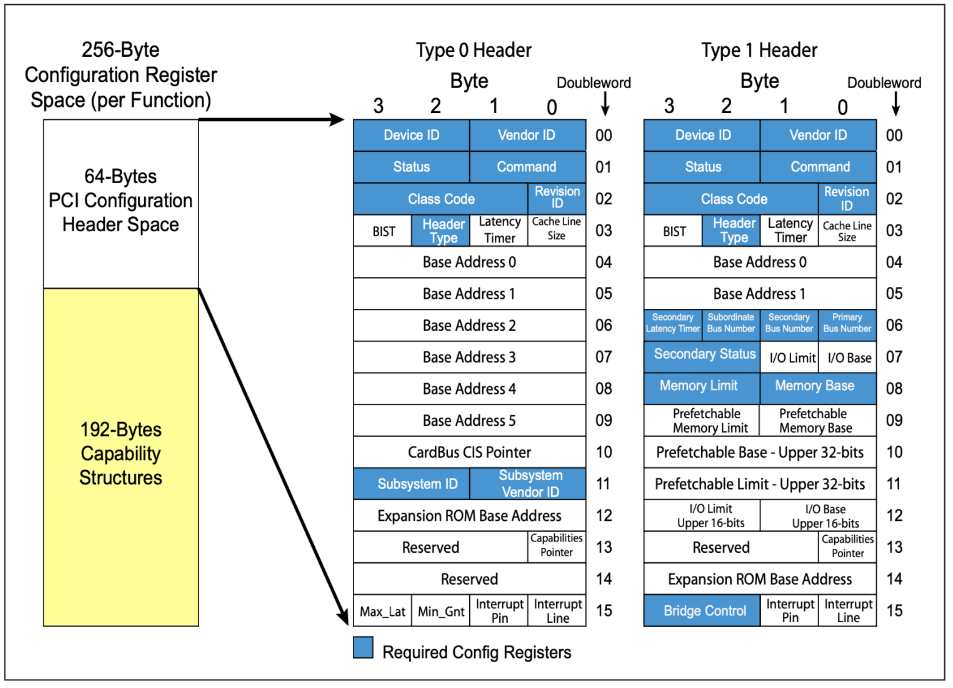
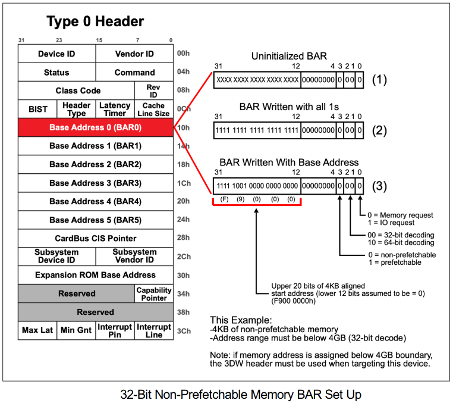
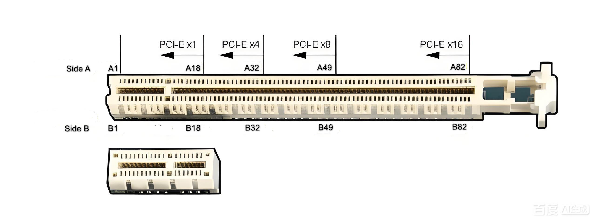
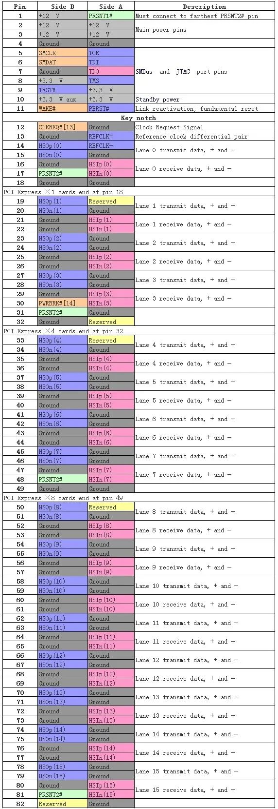
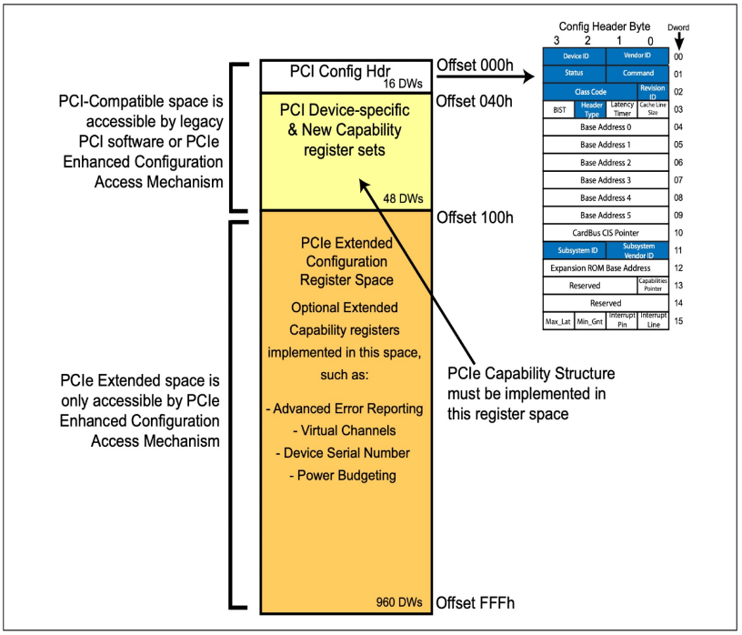

<style>
    h1 {
        text-align: center;
    }
    h2 {
        color: darkblue;
    }
    h5 {
        text-indent: 15px;
    }
    p {
        text-indent: 15px;
    }
    /* 表格居中 */
    .markdown-body table {
        width: fit-content;
        margin: 0 auto;
    }
    /* 折叠 */
    summary {
        color: blue;
        text-decoration: underline;
        text-indent: 15px;
        background-color: black;
        /* display: none;*/
    }
    /* 用此表示未完成项目 */
    .todo {
        color: red;
    }
    /* 用此表示已完成项目 */
    .done {
        color: green;
    }
</style>
# PCI

PCI（Peripheral Component Interconnect） 是一种并行、共享、同步时钟的本地总线标准。

## 特征
| 特性   | PCI                     |
| ---- | ----------------------- |
| 总线类型 | 并行共享总线              |
| 时钟   | 所有设备共用一个时钟          |
| 拓扑   | 单总线 + 仲裁器          |
| 带宽   | 固定（32/64bit × 33/66MHz） |
| 扩展性  | 很差                      |
| 热插拔  | 基本不支持                   |

## 硬件结构
### 共享总线模型
```arduino
        CPU / Host Bridge
               |
   --------------------------------
   |        |        |            |
 DeviceA  DeviceB  DeviceC     DeviceD
```
* 所有设备挂在同一条并行总线
* 任一时刻 只能一个设备传输
* 其他设备必须等待

### 仲裁机制（Bus Master）

PCI 支持多主设备（Bus Master）：

* 设备可以主动发起 DMA
* 需要 中央仲裁器

信号线：

* REQ#：请求总线
* GNT#：授予总线

### 性能
| 模式        | 位宽    | 频率    | 理论带宽      |
| --------- | ----- | ----- | --------- |
| PCI 32/33 | 32bit | 33MHz | ~133 MB/s |
| PCI 32/66 | 32bit | 66MHz | ~266 MB/s |
| PCI 64/66 | 64bit | 66MHz | ~533 MB/s |

这是整个总线的带宽，被所有设备共享。

<a id="pci_configuration_space"></a>
### PCI 配置空间（Configuration Space）
#### 本质作用
* 设备自描述
    * 我是谁（Vendor / Device）
    * 我是干什么的（Class Code）
* 资源申请
    * 我要多大的地址空间（BAR）
    * 我要不要中断、DMA
* 总线管理
    * 使能 / 禁用 IO、MMIO、Bus Master

👉 CPU / OS 通过读取设备空间，不需要提前知道设备型号，也能完成初始化

#### 属性
| 项目     | 说明                 |
| ------ | ------------------ |
| 大小     | **256 Bytes（PCI）** |
| 访问方式   | 专用配置访问             |
| 是否内存映射 | ❌（不是 MMIO）         |
| 是否设备私有 | ❌（OS 必须能读写）  ≠ 设备寄存器空间      |

#### 结构
配置空间标准布局:



##### Vendor ID/Device ID
`Vendor ID`（厂商）和 `Device ID`（具体型号） 用于 OS 匹配驱动。

例如 Linux 代码：
``` C
static const struct pci_device_id xxx_ids[] = {
    { PCI_DEVICE(0x8086, 0x100e) },
};
```

##### command
`Command` 用于控制功能开关

| Bit | 名称                  | 作用         |
| --- | ------------------- | ---------- |
| 0   | IO Space Enable     | 允许 IO BAR  |
| 1   | Memory Space Enable | 允许 MMIO    |
| 2   | Bus Master Enable   | 允许 DMA |

##### Status
`Status` 用于报告错误，是否支持 capability list（bit 4），中断状态。

##### Class Code
`Class Code` 为 3 字节，表示该设备的用途：

| Byte       | 含义   |
| ---------- | ---- |
| Base Class | 大类   |
| Sub Class  | 子类   |
| Prog IF    | 接口细节 |

例如蓝牙设备的 Class Code 如下，即使没有 Vendor 驱动，也能加载通用驱动。（实际应用中，蓝牙网卡通常是 USB 设备）。

| 字段         | 值      | 含义                           |
| ---------- | ------ | ---------------------------- |
| Base Class | `0x0D` | Wireless Controller          |
| Sub Class  | `0x11` | Bluetooth                    |
| Prog IF    | `0x00` | Generic Bluetooth Controller |

##### Header Type
* 0 – Used by non-bridge devices, such as EP devices.
* 1 – Used by Switch and Bridge devices.

<a id="pci_bar"></a>
##### BAR（Base Address Register）

`BAR` 用于设备向 Host 申请的“地址窗口”。包含：

* 地址类型
    * IO BAR：       传统 IO 端口
    * Memory BAR：   MMIO（最常见）
    * 32-bit：       地址 < 4GB
    * 64-bit：       占用两个 BAR
* 地址大小
* 设备寄存器映射点

BAR 的交互如下：

* Host 读取 BAR 初始值
* 从 bit[3:0] 判断 BAR 类型
* Host 写 0xFFFFFFFF 探测 size
    * 例如设备内部只有 4KB 寄存器，则设备返回 0xFFFFF000
* Host 再读 BAR
* Host 计算 size
* Host 分配地址
    * 例如分配 BAR base = 0xF9000000
* Host 写回 BAR（保留低位类型位）
    * 后面 Host 访问地址 0xF9000380, 则对应了设备的地址 0x380



PS：Host 会依次处理所有 BAR， 但一般设备只有一两个 BAR 有效。

##### Interrupt Line / Pin
设备通过 `Interrupt Pin` 声明用哪根脚。

BIOS/RC 填 `Interrupt Line` 指向系统 IRQ 号。PCIe 中基本被 MSI 取代。

##### Capability
Capability List 是一个链表结构，每个节点最少两个字节，前两个字节结构固定
```
0 : Capability ID        (1 Byte)
1 : Next Capability Ptr  (1 Byte)
2-: 私有结构
```
Capability ID：标识功能类型（MSI=0x05, MSI-X=0x11, PCIe=0x10 等）

Next Capability Ptr：下一个 capability 在配置空间的偏移，0x00 表示链表结束。

后续的字节根据 capability 类型不同而不同。

除了 Capability Pointer，后续的 capabilitys 必须位于 0x40 ~ 0xFF 区域。

👉 PCIe 几乎所有高级功能都在 capability 里。

<a id="pci_enumeration"></a>
#### 枚举（enumeration）

让系统在运行时“发现有哪些外设、它们是谁、怎么访问、用什么驱动”的过程。

这是一个自动识别 + 建立软件视图的过程，一般包括：

1. 发现外设是否存在
2. 读取外设的身份信息
3. 为外设分配系统资源
4. 创建 OS 中的设备对象
5. 绑定合适的驱动

PCI/PCIe 的枚举过程：

1. Host 从 Bus 0 / Device 0 / Function 0 开始扫描
2. 访问 配置空间
3. 读取：
    * Vendor ID
    * Device ID
    * Class Code
4. 判断设备是否存在
5. 给设备分配：
    * BAR（MMIO / IO 地址）
    * IRQ / MSI
6. OS 根据 ID 匹配驱动


# PCIe
PCIe（Peripheral Component Interconnect Express） 是一种高速、点对点、串行的通用外设互连总线，用于 CPU / SoC 与高性能外设之间通信（网卡、SSD、Wi-Fi、FPGA 等）。

把传统 PCI/PCI-X 的并行总线，升级成可扩展的高速串行链路

## 特征
| 维度 | PCI / PCI-X | PCIe                          |
| -- | ----------- | ----------------------------- |
| 拓扑 | 并行共享总线      | **点对点 + Switch**              |
| 传输 | 并行          | **串行差分**                      |
| 时钟 | 全局共享        | **嵌入式时钟（8b/10b / 128b/130b）** |
| 带宽 | 固定          | **按 Lane 线性扩展**               |
| 枚举 | 中心化         | **分层枚举（Root → Endpoint）**     |


## 硬件结构
<a id="pcie_topology"></a>
### PCIe 拓扑结构
```mathenatica
CPU
 |
Host Bridge
 |
Root Complex
 |
 +-- Root Port RP0 ── Switch A ── EP_A
 |                  |
 |                  +─ Switch B ── EP_B1
 |                               └─ EP_B2
 |
 +-- Root Port RP1 ── EP_C
 |
```
#### 设备类型
##### Root Complex (RC)

通常在 CPU / SoC 内, 负责发起 PCIe 枚举，管理配置空间

Linux 下对应 `pci-host-controller`

##### Host Bridge（Host-to-PCI Bridge）
CPU 世界 ↔ PCIe 世界的分界线, 把 CPU 地址 / 中断 / DMA 翻译成 PCIe 事务

只能在最顶端，下面允许挂 Endpoint（规范允许，工程几乎没有）和 Root Port。

##### Root Complex（概念，不是设备）
是一个集合，包含 Host Bridge，一个或多个 Root Port，MSI / ECAM / DMA 等逻辑。

##### Root Port（PCIe Root Port / Bridge）
Root Complex 里的 PCIe 物理出口，一条 PCIe Link 的发起端。

下游可以是 Endpoint 或者 PCIe Switch

电脑主板上的 PCIe 插口是一个 Root Port 的接口。如果插上 Wi-Fi 网卡就是接上了个 Endpoint，如果插上多口 NVMe 扩展卡就是接上了个 Switch。
##### Switch
Switch 不是一个单一设备，而是一组端口设备，用于扩展端口数量（类似 PCIe hub）

下游可以是 Endpoint 或者 PCIe Switch

##### Endpoint (EP)

真实外设（网卡、SSD、Wi-Fi、FPGA），提供 BAR、MSI、中断等

无下游设备。

## 数据传输
### PCIe引脚定义
PCIe 插槽有不同的物理配置：x1、x4、x8、x16、x32。x 后面的数字表示 PCIe 插槽有多少个通道（每对接收和发送对称作一个通道(lane)）, PCIe 插槽是兼容的，例如 PCIe x16 的插槽上可以插入 PCIe x1 的无线网卡。

下面是 PCIe x16 和 PCIe x1 的插槽图片和引脚定义。





其中

* PRSNT1# 和PRSNT2# 引脚必须比其余稍短，以确保热插入卡时其余管脚完全插入。
* WAKE# 引脚采用全电压唤醒计算机，但必须拉高从备用电源，以表明该卡是能够唤醒。
* PERST# 由 RC 端控制，拉低并拉高可以让 EP 端硬件重启

PCIe可拓展性强，可以支持的设备有：显卡、固态硬盘（PCIe接口形式）、无线网卡、有线网卡、声卡、视频采集卡、PCIe转接M.2接口、PCIe转接USB接口、PCIe转接Tpye-C接口等。（满血的雷电3指的是PCIe X4、残血的指的是PCIe X2。带宽不同，支持的速度也是不一样的）

M.2接口通道也是一种PCIe接口，主要支持M.2的固态硬盘和蓝牙 Wi-Fi 双模无线网卡（PCIe（Wi-Fi） + USB（蓝牙））。

### 速率
PCI 使用并口传输数据，单个时钟周期可以传输 32bit 或者 64bit；PCIe使用串口传输数据，单个时钟周期可以传输 1bit。为什么 PCI 反而比较慢呢？

#### PCI
* 在发送端，数据在某个时钟沿传出去（左边时钟第一个上升沿），在接收端，数据在下个时钟沿（右边时钟第二个上升沿）接收。因此，要在接收端能正确采集到数据，要求时钟的周期必须大于数据传输的时间（从发送端到接收端，flight time)。受限于数据传输时间（该时间还随着数据线长度的增加而增加），因此时钟频率不能做得太高（33/66MHz）。
* 时钟信号在线上传输的时候，也会存在相位偏移（clock skew )，影响接收端的数据采集；
* 接收端必须等最慢的那个 bit 数据到了以后，才能锁住整个数据 （signal skew）。

| 模式        | 位宽    | 频率    | 理论带宽      |
| --------- | ----- | ----- | --------- |
| PCI 32/33 | 32bit | 33MHz | ~133 MB/s |
| PCI 32/66 | 32bit | 66MHz | ~266 MB/s |
| PCI 64/66 | 64bit | 66MHz | ~533 MB/s |

#### PCIe
* 它没有外部时钟信号，它的时钟信息通过8/10编码或者128/130编码嵌入在数据流，接收端可以从数据流里面恢复时钟信息，因此，它不受数据在线上传输时间的限制，你导线多长都没有问题，你数据传输频率多快也没有问题；
* 没有外部时钟信号，自然就没有所谓的clock skew问题；
* 由于是串行传输，只有一个bit传输，所以不存在signal skew问题。
    * 如果使用多条lane传输数据（串行中又有并行，哈哈），这个问题又回来了，因为接收端同样要等最慢的那个lane上的数据到达才能处理。

| PCIe 版本   | 速率 (GT/s) | 编码方式       | 编码效率     | X1 单向带宽    | X16 单向带宽    |
| --------- | --------- | ---------- | -------- | -------------- | -------------- |
| PCIe 1.0  | 2.5 GT/s  | 8b/10b     | 80%      | 250 MB/s   |  4 GB/s  |
| PCIe 2.0  | 5.0 GT/s  | 8b/10b     | 80%      | 500 MB/s   |  8 GB/s  |
| PCIe 3.0  | 8.0 GT/s  | 128b/130b  | ≈98.46%  | ~985 MB/s  | ~15.8 GB/s  |
| PCIe 4.0  | 16.0 GT/s | 128b/130b  | ≈98.46%  | ~1969 MB/s | ~31.5 GB/s |
| PCIe 5.0  | 32.0 GT/s | 128b/130b  | ≈98.46%  | ~3938 MB/s | ~63.0 GB/s |
| PCIe 6.0* | 64.0 GT/s | PAM4 + FEC | ~96%（有效） | ~7560 MB/s | ~121.0 GB/s |

> GT/s（Giga-Transfers per second）每秒“符号传输次数”

> Xn 带宽 = X1 带宽 * N

### 设备发现
#### LTSSM （Link Training and Status State Machine）状态机

LTSSM 是 PCIe PHY + Controller 内部的硬件状态机，用来一步一步推进 Link Training。

LTSSM 状态机有如下状态：

```
0x0: detect.quiet
0x1: detect.active
0x2: polling.active
0x3: polling.compliance
0x4: polling.configuration
0x5: config.linkwidthstart
0x6: config.linkwidthaccept
0x7: config.lanenumwait
0x8: config.lanenumaccept
0x9: config.complete
0xa: config.idle
0xb: recovery.receiverlock
0xc: recovery.equalization
0xd: recovery.speed
0xe: recovery.receiverconfig
0xf: recovery.idle
0x10: L0
0x11: L0s
0x12: L1.entry
0x13: L1.idle
0x14: L2.idle/L2.transmitwake
0x16: disable
0x17: loopback.entry
0x18: loopback.active
0x19: loopback.exit
0x1a: hotreset
```

#### Link Training（PCIe 独有）
Link Training 是 PCIe 链路从“没法用”到“可用”的全过程，其目标只有 4 个：

* 发现对端是否存在
* 确定 Lane 数（x1 / x2 / x4 / x8 / x16）
* 确定速率（Gen1 / Gen2 / Gen3 / …）
* 校准物理层（均衡、时钟、极性、对齐）

完成后，链路进入 L0（可用）

0. 前置条件
    * RC & EP
        * `PERST#` = 1（de-assert）
        * REFCLK valid（100 MHz）
        * 本地 PHY ready / PIPE ready
1. RC 拉低 `PERST#`（assert）
    * RC
        * `PERST#` = 0
        * LTSSM： Disabled / Detect.quiet
    * EP
        * PHY reset
        * LTSSM： Disabled / Detect.quiet
2. RC 拉高 `PERST#`（de-assert）
    * RC
        * `PERST#` = 1
        * 等待 REFCLK stable
        * 等待 PHY PLL lock
        * LTSSM： Detect.quiet
    * EP
        * 等待 REFCLK 稳定
        * 等待 PIPE ready / PHY ready
        * LTSSM： Detect.quiet
3. LTSSM Detect
    * RC & EP
        * LTSSM： Detect.quiet
            * Tx：Electrical Idle
            * Rx：监听对端 termination
                * 检测对端是否存在 50Ω 终端
                * 判断链路是否“物理连着”
            * 这里只是模拟电气探测，并不是电平变化
        * LTSSM： Detect.active
            * Tx：发送 Detect Pulse / Beacon
            * Rx：监听是否有对端响应
4. Polling
    * RC & EP
        * LTSSM： polling.active
            * 发送 TS1 / TS2
            * 接收对端 TS
        * LTSSM： polling.configuration
            * 确认 TS 能稳定收发
        * 若失败会进入： polling.compliance
5. Configuration
    * RC & EP
        * LTSSM： config.linkwidthstart
            * 确定最大可用 Lane 集合
        * LTSSM： config.lanenumaccept
            * 确认 lane 编号映射
        * LTSSM： config.complete
            * 链路参数锁定
            * Lane 数最终确定
        * LTSSM： config.idle
            * 准备进入 L0
6. L0（Link Up）
    * LTSSM： L0
    * Data Link Layer ready
    * 可以收发 TLP/DLLP
    * 此时 RC 可以枚举到设备
7. L0s / L1
    * LTSSM： L0s
    * 若双方 ASPM（Active State Power Management）enabled 并链路空闲， RC 发起省电请求后进入
8. Others
    * LTSSM： loopback.xxx
        * PCIe PHY / Link 的自检模式，不需要对端参与
        * 一般用于厂内调试
    * LTSSM： hotreset
        * RC 端用于重新初始化设备

#### 枚举（enumeration）
枚举过程和 PCI 相同，详见[PCI 枚举](#pci_enumeration) 和[PCIe 配置空间](#pcie_configuration_space)。


<a id="pcie_configuration_space"></a>
## PCIe 配置空间（Configuration Space）

和 [PIC 配置空间](#pci_configuration_space)基本相同。少量的区别如下：

| 项目     | PCI        | PCIe                    |
| ------ | ---------- | ----------------------- |
| 配置空间大小 | 256B       | 4KB                 |
| 访问方式   | I/O 端口     | MMIO（ECAM）          |
| 拓扑     | 共享总线       | 点对点                 |
| 扩展能力   | Capability | Extended Capability |



#### Vendor ID、Device ID、Command、Status、Class Code、Header Type 等
和 PCI 相同。

#### ECAM
ECAM（Enhanced Configuration Access Mechanism）又名 PCIe 配置空间访问机制，是把“配置空间”直接映射成一段 MMIO 地址。

> * Port-mapped I/O
>     * 用专用 I/O 指令访问外设（如 x86 的 in/out）
> * MMIO = Memory-Mapped I/O（内存映射 I/O）
>    * CPU 用“访存指令”访问硬件寄存器，而不是用专用 I/O 指令。即把设备寄存器，当成一段“不能缓存的内存”

`ECAM Address`=`Base Address` + (`Bus` << 20) + (`Device` << 15) + (`Function` << 12) + `Register Offset`

1. BaseAddress：系统分配给 ECAM 的起始地址。这是一个固定的基地址，用于标识 ECAM 区域的开始位置。在系统初始化时，操作系统或固件会分配一段连续的内存区域作为 ECAM 的基地址。
2. Bus：PCIe 总线号，范围为 0 到 255。它表示设备在 PCIe 拓扑结构中的总线位置。
3. Device：设备号，范围为 0 到 31。它表示在特定总线上挂载的设备编号。
4. Function：功能号，范围为 0 到 7。一个 PCIe 设备可能包含多个功能模块，功能号用于区分这些模块。
5. RegisterOffset：配置寄存器的偏移量，范围为 0 到 4095 字节。它表示要访问的配置寄存器在设备配置空间中的具体位置。

例如，示例[PCIe 拓扑结构](#pcie_topology)经过枚举后，得到的地址是：
```yaml
Bus 0  (Root Bus)
├─ dev0: Host Bridge
├─ dev1: Root Port RP0 (Bridge)
│        └── Bus 1
│            ├─ dev0: Switch A Upstream Port (Bridge)
│            │        └── Bus 2
│            │            └─ dev0: Switch A Downstream Port 0 (Bridge)
│            │                    └── Bus 3
│            │                        └─ dev0: EP_A
│            │
│            └─ dev1: Switch B Upstream Port (Bridge)
│                     └── Bus 4
│                         ├─ dev0: Switch B Downstream Port 0 (Bridge)
│                         │        └── Bus 5
│                         │            └─ dev0: EP_B1
│                         │
│                         └─ dev1: Switch B Downstream Port 1 (Bridge)
│                                  └── Bus 6
│                                      └─ dev0: EP_B2
│
├─ dev2: Root Port RP1 (Bridge)
│        └── Bus 7
│            └─ dev0: EP_C
```
Linux 下可以通过命令 `lspci` 显示所有的 Pcie 节点：
```bash
baohongde@FA001538:~$ lspci
00:00.0 Host bridge: Intel Corporation Comet Lake-S 6c Host Bridge/DRAM Controller (rev 03)
00:02.0 VGA compatible controller: Intel Corporation CometLake-S GT2 [UHD Graphics 630] (rev 03)
00:08.0 System peripheral: Intel Corporation Xeon E3-1200 v5/v6 / E3-1500 v5 / 6th/7th/8th Gen Core Processor Gaussian Mixture Model
00:14.0 USB controller: Intel Corporation Comet Lake PCH-V USB Controller
00:14.2 Signal processing controller: Intel Corporation Comet Lake PCH-V Thermal Subsystem
00:16.0 Communication controller: Intel Corporation Comet Lake PCH-V HECI Controller
00:17.0 SATA controller: Intel Corporation 400 Series Chipset Family SATA AHCI Controller
00:1b.0 PCI bridge: Intel Corporation Comet Lake PCI Express Root Port #21 (rev f0)
00:1c.0 PCI bridge: Intel Corporation Comet Lake PCI Express Root Port #05 (rev f0)
00:1f.0 ISA bridge: Intel Corporation B460 Chipset LPC/eSPI Controller
00:1f.2 Memory controller: Intel Corporation Memory controller
00:1f.3 Audio device: Intel Corporation Comet Lake PCH-V cAVS
00:1f.4 SMBus: Intel Corporation Comet Lake PCH-V SMBus Host Controller
01:00.0 Non-Volatile memory controller: SK hynix BC511
02:00.0 Ethernet controller: Realtek Semiconductor Co., Ltd. RTL8111/8168/8411 PCI Express Gigabit Ethernet Controller (rev 15)
```
其中前面的编号是 `Bus:Device.Function`, 通常也被称为 `BDF`。

* `00:00.0 Host bridge:` 表示 Bus0：Device0.Function0，是 Host bridge；
* `00:02.0 VGA compatible controller:` 是集成显卡（iGPU）；
    * 这是一个“假 PCIe EP”（无物理 link）。
    * 是CPU 内部的 EP（逻辑上），并不通过 PCIe Link，但为了统一模，仍然作为 PCI device 枚举在 Bus 0。
* `00:08.0 System peripheral:` 是 CPU 内部加速 / 计算单元；
    * 同样不是 PCIe EP
* `00:14.0` `00:14.2` `00:16.0` `00:17.0` `00:1f.0` `00:1f.2` `00:1f.3` `00:1f.4` 这些全部是 PCH（南桥）内部功能。
    * 同样不是 PCIe EP
* `00:1b.0` `00:1c.0` 是 Root Port，对应了主板上的 PCIe 插槽或者 M.2/板载网卡接口
* `01:00.0` 表示 Bus1：Device0.Function0, 是 NVMe SSD（Endpoint）， 说明主板上通过 PCIe 接了一块固态硬盘。
* `02:00.0` 表示 Bus2：Device0.Function0, 是常见 Realtek 板载 PCIe 网卡。

所以该主机的 PCIe 拓扑结构如下(非 PCIe 的枚举没有列出)：
```yaml
Bus 0  (Root Bus)
├─ dev00: Host Bridge
├─ dev1b: Root Port #21 (PCIe Bridge)
│         └── Bus 1
│             └─ dev00: NVMe SSD (EP)
│
└─ dev1c: Root Port #05 (PCIe Bridge)
          └── Bus 2
              └─ dev00: Realtek Ethernet (EP)
```

Linux 中，DTS 示例（简化）：
```dts
pcie0: pcie@... {
    reg = <ECAM_BASE ECAM_SIZE>;
    bus-range = <0x00 0xff>;
};
```

#### BAR（Base Address Register）

和 [PCI BAR](#pci_bar) 语义完全一致。

DTS 中的 ranges：
```dts
ranges = <
  /* PCI MEM → CPU */
  /* PCI_addr(3 cells)        CPU_addr(2 cells)   size(2 cells) */
  0x02000000 0x0 0x00000000   0x0 0x40000000      0x0 0x10000000
>;
```
* PCI_addr
    * PCI 地址空间类型；
        * 0x01000000    PCI I/O space
        * 0x02000000    PCI MEM (32-bit)
        * 0x03000000    PCI MEM (64-bit, prefetchable)
        * 这里表示这是 PCI 32-bit non-prefetchable Memory Space
    * PCI 地址高 32 位： PCI address [63:32]
        * 这是 32-bit PCI 地址空间，所以为 0。
    * PCI 地址低 32 位： PCI address [31:0]
        * 这里表示 PCI 总线侧起始地址 = 0x00000000。
* CPU_addr
    * 这里是 CPU 的物理地址（64 bit）。
    * 这里表示 CPU 物理地址 = 0x4000_0000
* size
    * 映射大小
    * 这里表示 256M

所以，这条 ranges 表示的映射关系为：
```
PCI MEM [0x0000_0000 .. 0x0FFF_FFFF]
        ↓
CPU PHY [0x4000_0000 .. 0x4FFF_FFFF]
```
#### PCIe Capability（这是 PCIe 的核心）
这是 PCIe 专有 Capability，ID = 0x10，里面包含：

* Device Cap
* Device Control
* Link Cap
* Link Status

#### Extended Capability（PCIe 才有）

因为 256B 的空间不够用， PCIe 扩展到了 4KB，Extended Capability 从 0x100 开始。

常见 Extended Capability
| ID     | 名称                       | 用途    |
| ------ | ------------------------ | ----- |
| AER    | Advanced Error Reporting | 错误定位  |
| ATS    | Address Translation      | IOMMU |
| SR-IOV | 虚拟化                      |       |
| L1SS   | 低功耗                      |       |

#### PCIe 中断机制（本质变化）
MSI / MSI-X 成为主流，取代了 Interrupt Line / Pin

* INTx：几乎不用
* MSI：写内存触发中断
* MSI-X：多 vector

嵌入式 RC 必须支持：

* MSI doorbell
* GIC / PLIC 映射


## 参考文献
[PCI Express® Base Specification 官网下载](https://pcisig.com/specification-overview/pci-express-base)
[PCI Express® Base Specification 在线浏览](https://picture.iczhiku.com/resource/eetop/SYkDTqhOLhpUTnMx.pdf)
